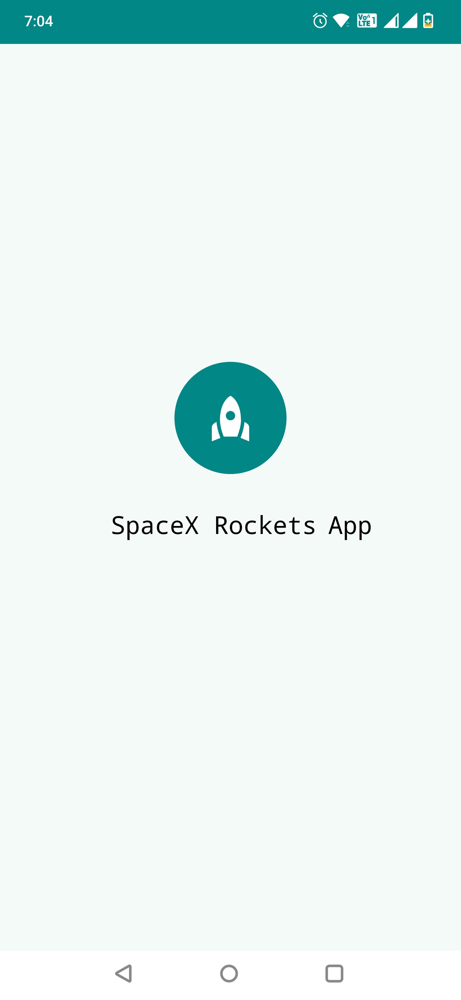
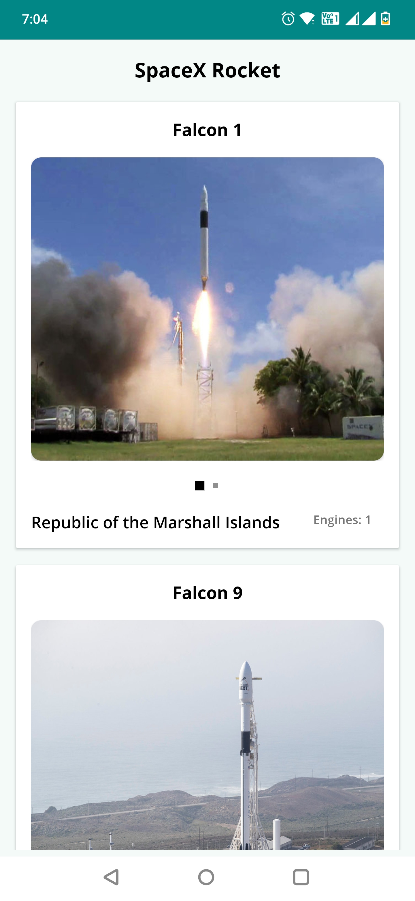
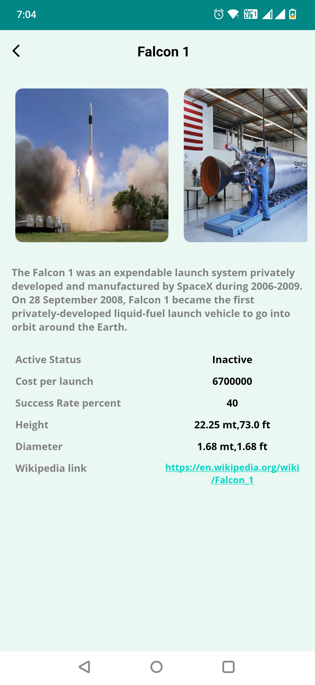

# SpaceX Rocket App

### Application Architecture
---

- IDE: Android Studio
- Programming Language: Kotlin
- Architecture: MVVM with clean architecture
- Third Party Libraries: Coroutines, Flow, Live data, DaggerHilt, Navigation Component, Retrofit, Glide
 

## Screenshots

||||
|:----:|:----:|:----:|

## Demo
https://user-images.githubusercontent.com/99521892/226182712-7b584b9a-26ca-4e2e-a201-0dca919d705a.mp4
